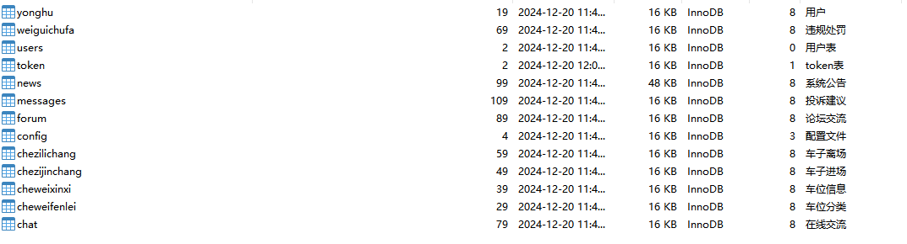

# 一、系统说明

基于springboot+vue的智能停车计费系统,系统功能齐全, 代码简洁易懂，适合小白学编程,课程设计，毕业设计。

# 二、系统架构

######      前端：vue| elementui

######      后端：springboot | mybatis 

######      环境：jdk1.8+ | mysql8.0 | maven

# 三、代码及数据库

# 四、相关功能介绍

#### 1).用户展示

###### 1.首页

###### 2.车位信息

###### 3.论坛交流

###### 4.系统公告

###### 5.投诉建议

###### 6.登录注册

###### 7.在线交流

###### 8.个人中心

###### 1.管理端登录

#### 2).管理端

###### 1.管理端登录

###### 2.首页

###### 3.个人中心->修改密码

###### 4.用户管理->用户

###### 5.车位分类管理->车位分类

###### 6.车位信息管理->车位信息

包含车位信息详情、进场、修改、删除

###### 7.车位进场管理->车子进场

###### 8.车位离场管理->车子离场

包含详情、处罚、删除

###### 9.违规处罚管理->违规处罚

包含详情、修改、删除

###### 10.投诉建议

###### 11.论坛交流

###### 12.系统管理->轮播图管理

###### 13.系统管理->系统公告

###### 14.系统管理->在线交流

